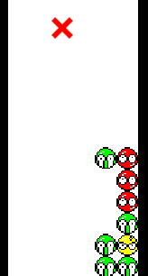

# PuyoPuyoCrusher




 A revamped Puyo Puyo AI that employs a tree-based-search as it's main methodology.

This has been developed as an HTTP microservice that takes requests about the gamestate of a puyo board, sending back a move to be made using JSON.

# Technologies :hammer:

This project was developed in Rust, with Actix Web as the framework for serving requests. It was designed this was for maximum portability, while also being extremely fast and safely written. 

The python code used to drive the Puyo game and visualize it was largely written by my brother, Eric Leclair. 

# Sending and reading responses :dart:

The API for this microservice has a single API endpoint.

Any instance of any Puyo game can simply send a POST request to the AI server, including the width and height of the board, the board itself, and the buffer of incoming Puyo pieces.

A sample of the JSON that must be sent can be located in the root of this repo, at `sample_board.json`.

The server responds with a list of moves to make, encoded in what I refer to as SPPN or Simple Puyo Puyo Notation:

```json
{
   "moves":[
      [
         1,
         2
      ]
   ]
}
```

This is a 2D array: the inner array will contain arrays of length 2, with the first entry being the column of the board the leftmost Puyo of the piece is to be placed in, with the orientation of the Puyo being denoted in the second, which can be decoded as follows:
 - 1 = upright
 - 2 = horizontal (left-to-right)
 - 3 = downwards
 - 4 = horizontal (right-to-left)


# How to run :car:

To run the code, you will want to clone this repository. 

From there, you can use `cargo` to build the AI microservice: 

- Install Rust / Cargo
- Navigate to `ai/puyoai`
- Run `cargo build --release`
- Run the executable puyoai file in the target directory. 

- In a separate terminal, navigate to `game`
- Run `python puyovisualizer.py`

Note that not building the release version of the microservice may result in excessively slow operation. 

# To do list :rocket:

- Alter search to make use of a more advanced heuristic, creating more significant chains :arrows_counterclockwise:
